# GradeMaster

GradeMaster ist eine Webanwendung zur Verwaltung von Kursen, Studenten und Gruppenzuweisungen. Die Anwendung unterstützt Dozenten und Studenten bei der Organisation und Bewertung von Kursen.

---

## Projektteam

| Name            | Matrikelnummer | E-Mail                           |
|-----------------|----------------|-----------------------------------|
| Rana Beyaz      | 85905          | 85905@studmail.htw-aalen.de      |
| Fatme Khraizat  | 85910          | 85910@studmail.htw-aalen.de      |
| Emre Hirka      | 86169          | 86169@studmail.htw-aalen.de      |
| Emre Tülü       | 83128          | 83128@studmail.htw-aalen.de      |
| Evren Kacar     | 83061          | 83061@studmail.htw-aalen.de      |

---

## Systemanforderungen

Um GradeMaster lokal auszuführen, sind folgende Systemanforderungen erforderlich:

- **Maven**: Version 3.8 oder höher
- **Java**: Version 17 oder höher
- **Node.js**: Version 18 oder höher
- **Angular CLI**: Version 15 oder höher
- **Datenbank**: H2 (In-Memory-Datenbank, integriert in der Spring Boot Anwendung)
- **IDE**: IntelliJ IDEA (empfohlen) oder jede andere IDE mit Unterstützung für Java und Angular
- **Webbrowser**: Ein moderner Browser wie Google Chrome, Firefox oder Edge


## Installation und Vorbereitung

### Backend (Spring Boot):

1. **Repository klonen:**
   ```bash
   git clone https://github.com/RanaB38/HSAA_GradeMaster_Gruppe2-main.git
   ```
2. **Nächster Schritt**
   -> HSAA_GradeMaster_Gruppe2-main\HSAA_GradeMaster_TeamName-main\grade-master- service\src\main\java\de\hsaalen\grademaster\grademasterservice\GradeMasterServiceApplication.java

   
3. **Starten mit GradeMasterServiceApplication**

   public static void main(String[] args) {
           SpringApplication.run(GradeMasterServiceApplication.class, args);
   
5. **Backend testen:**
   Die REST-API ist unter `http://localhost:8080` erreichbar. Beispielendpunkte:
- `GET /courses`
- `POST /students`

### Frontend (Angular):
1. **In das Frontend-Verzeichnis wechseln:**
   ```bash
   cd HSAA_GradeMaster_TeamName-main
    cd grade-master-ui
   ```
2. **Abhängigkeiten installieren:**
   ```bash
   npm install
   ```
3. **Angular-Anwendung starten:**
   ```bash
   ng serve
   ```
4. **Frontend aufrufen:**
   Die Anwendung ist unter `http://localhost:4200` erreichbar.

---
Screenshots der Anwendung

## 1. Login-Formular

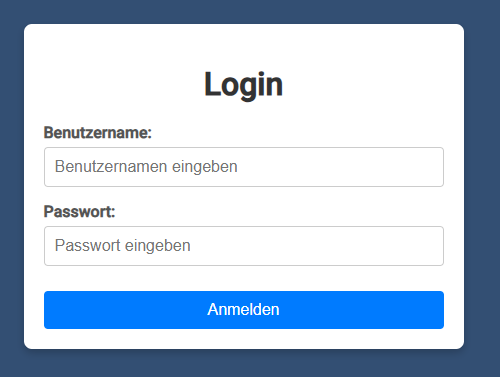

## 2. Menubar

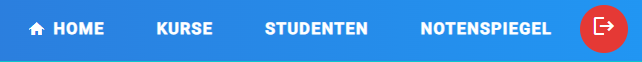

## 3. Homepage


## 4. Kurs und Dialog Kurs erstellen

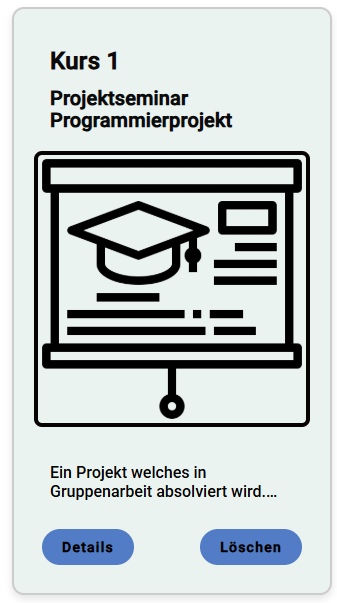

Button zum öffnen des Dialogs


Dialog


## 5. Kursdetails und Dialoge

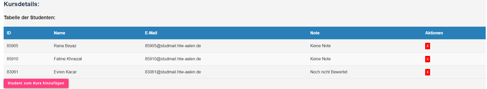

Dialog Student zu Kurs hinzufügen

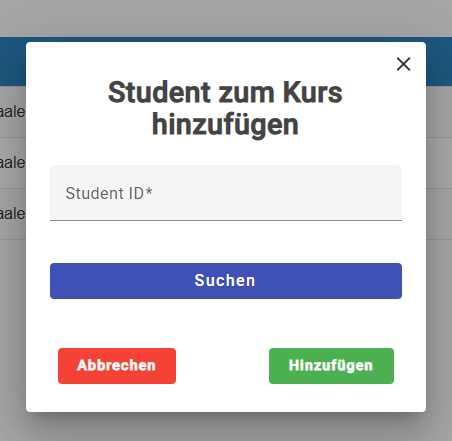

## Gruppe:

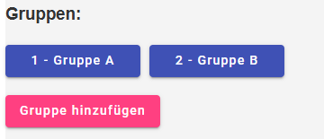

Dialog Gruppe hinzufügen

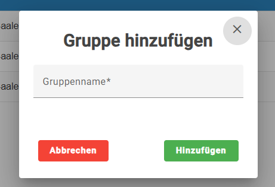

## Bewertungsschema:

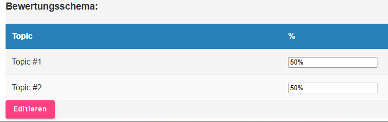

Bewertungsschema Editieren

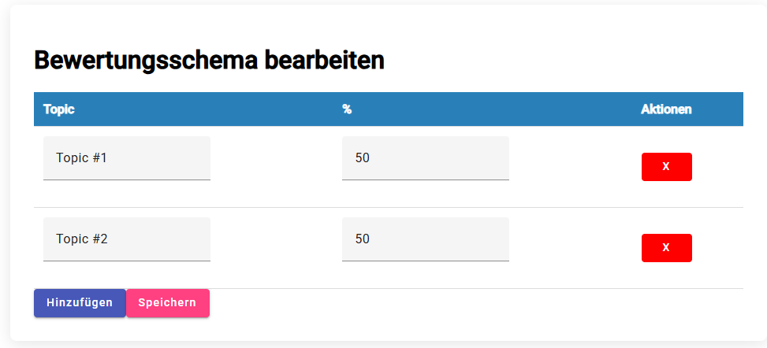

## 5.Studentenlist und Dialog Studenten hinzufügen

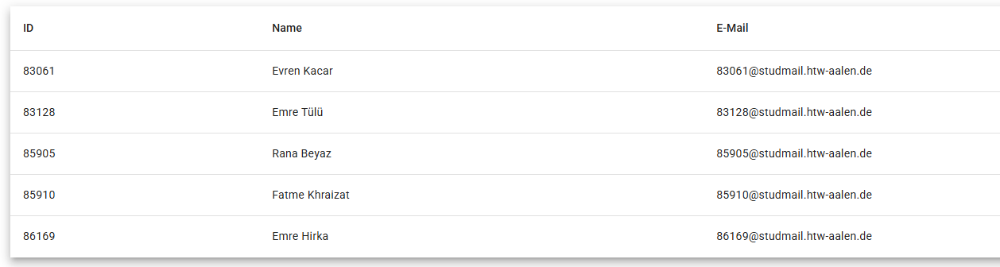

Button zum öffnen des Dialogs


Dialog (Nummer eingeben API -> Suchen -> API übermittelt Daten)

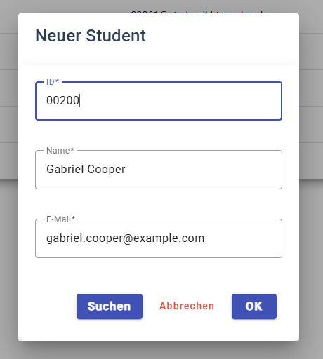


## Nutzung der Anwendung

1. **Login:**
- Standardnutzer:
  - Dozent(Lecturer):   Benutzername `user2`, Passwort `password`
  - Student:            Benutzername `user1`, Passwort `password`
  - Die Login-Seite ist standardmäßig erreichbar unter `http://localhost:4200`.

2. **Kurse verwalten:**
- Kurse können auf der Kurs-Seite hinzugefügt, bearbeitet und gelöscht werden.
- Beispiel:
  - `Projektseminar Programmierprojekt` ist als Standardkurs vorab in der Datenbank hinterlegt.


3. **Studenten verwalten:**
- Studenten können auf der Studenten-Seite hinzugefügt und in Kurse/Gruppen eingeteilt werden.
- Beim Hinzufügen eines Studenten werden die Felder Name und E-Mail automatisch ausgefüllt, sofern die Matrikelnummer korrekt eingegeben wurde (Von der API)

4. **Gruppen erstellen und verwalten:**
- Auf der Kursdetail-Seite können Gruppen erstellt und Studenten zugewiesen werden.
- Gruppen können bewertet werden, wobei das Bewertungsschema individuell anpassbar ist.

5. **Notenspiegel:**
- Der Notenspiegel zeigt die Notenverteilung anhand der prozentualen Leistung.
- Beispiel:
  - 100 - 94,9 % = 1,0 (Sehr gut)
  - < 50,0 % = 5,0 (Nicht bestanden)

---

## Technische Details

### Sicherheitskonfiguration
- Authentifizierung erfolgt per HTTP Basic Auth.
- Rollen:
  - **STUDENT**: Lesezugriff auf private API-Endpunkte.
  - **LECTURER**: Lese- und Schreibzugriff auf private API-Endpunkte.
- Zugriffsbeschränkungen:
  - `/h2/**` und `/public/**` sind ohne Authentifizierung zugänglich.
  - Private Endpunkte (z. B. `/api/private/**`) erfordern die entsprechende Rolle.

### CORS-Konfiguration
- Zugelassener Ursprung: `http://localhost:4200`.
- Zugelassene Methoden: `GET`, `POST`, `PUT`, `DELETE`.

### Datenbankkonfiguration
- **Datenbank:** H2 (In-Memory).
- **Benutzername:** `Gruppe2`, **Passwort:** (leer).
- H2 Console ist erreichbar unter `http://localhost:8080/h2`.
- Beim Start werden Beispieldaten aus der Datei `data.sql` geladen.

### Fehlerbehandlung und Logging
- Ausführliche Fehlermeldungen sind aktiviert (`server.error.include-message=always`).
- Sicherheitsbezogene Ereignisse werden im Debug-Modus protokolliert (`logging.level.org.springframework.security=DEBUG`).


### Lokale Datenbank
- Die Anwendung nutzt eine H2-Datenbank (In-Memory).
- Beispieldaten werden beim Start der Anwendung automatisch geladen.

### Angular Services und Komponenten
- **`auth.service.ts`**: Verantwortlich für die Authentifizierung und Autorisierung der Benutzer.
- **`course-core.service.ts`**: Kommuniziert mit dem Backend zur Verwaltung von Kursen.
- **`group-core.service.ts`**: Verwaltet Gruppenfunktionen wie Zuweisung und Bearbeitung.
- **`notenspiegel-core.service.ts`**: Bezieht und verarbeitet die Daten des Notenspiegels.
- **`student-core.service.ts`**: Verwaltung der Studenten und deren Zuweisung zu Kursen oder Gruppen.
- **`course-provider.service.ts`**: Bereitstellung von Kursdaten für die Komponenten.
- **`notenspiegel-provider.service.ts`**: Liefert Notenspiegel-Daten an die Frontend-Komponenten.
- **`student-provider.service.ts`**: Unterstützt die Frontend-Komponenten bei der Anzeige von Studentendaten.
- **`course.component.ts`**: Steuert die Darstellung und Interaktion der Kursansicht.
- **`student.component.ts`**: Verantwortlich für die Anzeige und Verwaltung von Studenten.
- **`student-detail.component`**: Zeigt die Details eines Studenten an, einschließlich Matrikelnummer, Name und E-Mail.
- **`student-dialog.component`**: Ermöglicht das Hinzufügen eines neuen Studenten, inklusive Validierung und API-Suche.
- **`student-list.component`**: Listet alle Studenten in einer Tabelle auf, mit Funktionen zum Hinzufügen und Auswählen eines Studenten.
- **`app.component.ts`**: Hauptkomponente der Angular-Anwendung, die als Einstiegspunkt dient.

---

## Weitere Hinweise

- **Fallback-System:**
  - Falls die API zur Studentensuche nicht verfügbar ist, wird ein lokaler Speicher (Map) zur Simulation der Studentendaten verwendet.

- **Code-Dokumentation:**
  - Javadoc (für Java) und JSDoc (für JavaScript) sind integriert, um den Code leicht verständlich zu machen.

- **Bekannte Einschränkungen:**
  - Der erste API-Aufruf kann länger dauern, da der Service möglicherweise inaktiv ist.

---

## Kontakt
Für weitere Informationen oder Rückfragen zum Projekt wenden Sie sich bitte an die Mitglieder der Projektgruppe.
